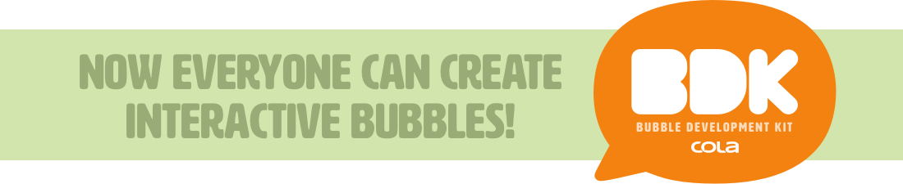

# cola-bubble

This repository contains the source code and dependencies to start developing a Bubble for Cola Messenger, the new group messaging platform from [Cola](http://cola.io).

Download [Cola Messenger](http://cola.io/get) for iPhone

## Getting Started

To begin building bubbles for Cola Messenger, follow these steps:  

1. [Configure the Development Environment](#configure)
1. [Install Cola Messenger (iOS only)](#app)
1. [Request a Developer Configuration Profile](#profile)
1. [Hello World Bubble](#hello)
 - [Build](#build)
 - [Install](#install) 
 - [Debug](#debug) 
 - [Test](#test)

Next you can [build your own bubbles](#bubbles) or [see more examples](#examples).

<a name='configure'></a>
### Configure Development Environment
Cola Bubbles use [React Native](https://facebook.github.io/react-native/) which requires [Node.js](https://nodejs.org/). To get started, install the following:

1. [Node.js v5.6.0](https://nodejs.org/download/release/v5.6.0/) (required) Node.js is the JavaScript runtime used for bundling bubbles (**Note:** v5.6.0 is the approved version)
1. [Atom](https://atom.io/) (optional) IDE recommended by Facebook for developing React Native apps
1. [Nuclide](https://nuclide.io/) (optional) Atom plugin with support for [React](https://facebook.github.io/react/), [JSX](https://facebook.github.io/react/docs/jsx-in-depth.html), [Flow](https://flowtype.org/)
1. [Chrome](https://www.google.com/chrome/browser/desktop/index.html) (optional) Google Chrome Developer Tools can be used for debugging bubbles if Atom/Nuclide isn't installed

Check that `npm` (Node Package Manager) is installed or [install npm](https://www.npmjs.com) (if needed)

```sh
$ which npm
/path/to/npm
```

<a name='source'></a>
#### BDK Sources
To obtain BDK sources just [fork this repo](https://help.github.com/articles/fork-a-repo/) (`cola-bubble`) and then [clone the fork](https://help.github.com/articles/cloning-a-repository/). In your local clone of `cola-bubble` execute `npm install` to complete installation.

```sh
$ cd /path/to/cola-bubble
$ npm install
```

**Note:** this will download dependencies into `node_modules` and may take some time, depending on network speed.

<a name='app'></a>
### Install Cola Messenger
Install [Cola Messenger](http://cola.io/get) and follow the prompts to register with Cola. 

Cola works best with groups, so make sure to invite your family and friends to Cola so they can help you test your new Cola Bubble!

<a name='profile'></a>
### Development Profile
Request a signed [Cola Development Profile](http://cola.io/developer).

**Note:** the Development Profile Identifier (ex. `com.yourcompany.`) **must** prefix all Bubble identifiers that run with this profile (ex. `com.yourcompany.yourbubble`)

Cola will deliver your profile via email. To install, open the email on iPhone using **iOS Mail** app and tap the Cola Development Profile attachment. When prompted, find and tap **Copy to Cola** (might need to scroll the app icons to find Cola).

Once Cola Messenger opens, tap **Install**. View the installed Cola Development Profile in Cola Messenger in **Settings/Developer** section. Once you've [installed a bubble](#install), tap a given **Developer** item to see installed bubbles associated with that Development Profile.


<a name='hello'></a>
###  Hello World Bubble
Now we'll build, install, debug, and test the most simple bubble, the included **Hello World** bubble example (located in `HelloWorld` directory at the root of `cola-bubble`).

```sh
$ cd /path/to/cola-bubble
$ ls HelloWorld/
```

First open `HelloWorld/manifest.js` and update `identifier` to be compatible with the identifier in your [Development Profile](#profile) by changing `com.yourcompany.HelloWorld` to use your identifier. For example, if Development Profile has identifer `io.cola.` then `manifest.js` is updated as:

```diff
 {
   "format" : 1,
-  "identifier" : "com.yourcompany.HelloWorld",
+  "identifier" : "io.cola.HelloWorld",
   "version" : 1,
   "name" : "Hello World!"
 }
```

<a name='build'></a>
#### Build

Build the Hello World bubble by running the `bubbler` in `build` mode (see [BDK Sources](#source) if `cola-bubbles/node_modules` is missing). 

```sh
$ cd /path/to/cola-bubble
$ node node_modules/@colahq/cola-tools/bubbler build --development --source ./HelloWorld --destination /path/to/bubbler/output/

$ ls -R /path/to/bubbler/output
com.yourcompany.HelloWorld

/path/to/bubbler/output//com.yourcompany.HelloWorld:
1

/path/to/bubbler/output//com.yourcompany.HelloWorld/1:
index.bundle	index.map	manifest.json
```

<a name='install'></a>
#### Install

Install your Hello World bubble in Cola Messenger by transferring the `bubbler` output via a built-in WebDAV server, the Cola Development Server. To enable the Cola Development Server, open Cola Messenger, navigate to **Settings/Developer** section and toggle the **Cola Development Server** switch.

**Note:** it is recommended to disable auto-lock on iPhone and keep Cola Messenger active before connecting to Cola Development Server and while transferring bubbles (currently WebDAV port will change if Cola Messenger becomes inactive or iPhone locks or sleeps).

Now transfer the Hello World bubble folder to Cola Messenger using a WebDAV client (ex. [Transmit](https://panic.com/transmit/), [CyberDuck](https://cyberduck.io)). Usually Bonjour is the easiest way to connect to Cola Developer Server. There is no password for Cola Development Server so use **Guest** or **Anonymous** when connecting. Drag the entire folder (ex. `/path/to/bubbler/output/com.yourcompany.HelloWorld`) to the root directory of the Cola Development Server.

If installed successfully, Hello World bubble will now be available in the Bubble Menu (likely near the bottom, might need to scroll to find). Development bubbles are also listed in **Settings/Developer** section under the **Developer** item.

Now open an existing Cola conversation or create a new Cola group and send a Hello World bubble.

**Note:** anyone who hasn't yet installed the Hello World bubble won't see this bubble until they are given the Hello World bubble (see [Testing](#test)).

<a name='debug'></a>
#### Debug
Debug your Hello World bubble using Atom/Nuclide or Google Chrome.

**Note:** it is recommended to disable auto-lock on iPhone and keep Cola Messenger active when debugging (currently WebDAV port will change if Cola Messenger becomes inactive or iPhone locks or sleeps).

Ensure that bubble debugging is enabled in **Settings/Developer** section by toggling **Cola Bubble Debugger** switch.

Currently only one bubble can be enabled for debugging. By default the most recently transferred bubble will be the enabled debugging bubble. Verify that the correct bubble is enabled by reviewing the list of bubbles for the active developer under **Settings/Developer** section **Developer** item. If necessary, toggle the debugging switch for the desired bubble.

Now run the `bubbler` in `debugger` mode, where `<ip>:<port>` are the values displayed in **Settings/Developer** section under **Cola Development Server**.

```sh
$ cd /path/to/cola-bubble
$ node node_modules/@colahr/cola-tools/bubbler debugger --connect <ip>:<port> --source ./HelloWorld/

 ┌────────────────────────────────────────────────────────────────────────────┐ 
 │  Running packager on port 8081.                                            │ 
 │                                                                            │ 
 │  Keep this packager running while developing on any JS projects. Feel      │ 
 │  free to close this tab and run your own packager instance if you          │ 
 │  prefer.                                                                   │ 
 │                                                                            │ 
 │  https://github.com/facebook/react-native                                  │ 
 │                                                                            │ 
 └────────────────────────────────────────────────────────────────────────────┘ 

```

**Note:** if `Error: connect ETIMEDOUT` or `Error: connect ECONNREFUSED` check that Cola Messenger is foregrounded and active, Cola Development Server is enabled and `<ip>:<port>` are correct (may need to exit/enter Settings to get current values).

If you're using Atom/Nuclide, open **Nuclide** menu and select **React Native/Start Debugging**. If you're using Chrome, make sure Chrome is running.

Now cause a debug bubble to be instantiated by either navigating to this bubble in an existing conversation or composing this bubble via Bubble Menu. The debugger will attach to the first instance of a debug bubble.

To have the Atom/Nuclide or Chrome debugger pause on exceptions, choose the **Sources** tab, toggle the pause/stop button and check **Pause On Caught Exceptions**.

**Note:** when `bubbler` is in `debugger` mode, source changes will be picked up each time a bubble is instantiated so it is not necessary to build and install bubbles; just save your code and the next time your bubble is instantiated you will see your changes!

<a name='test'></a>
#### Test
Test your Hello World bubble with family and friends. To test a bubble you'll need to email your testers a) your Testing Profile and b) your Cola Bubble.

Currently a **Testing Profile** is the same as a [Development Profile](#profile). Forward the email you received containing your Development Profile to anyone who will be testing your bubble. Have your testers open the email on iPhone using **iOS Mail** app and install the profile (which will enable them to install and test your bubble).

Build your bubble in release mode (omit the `--development` flag).

```sh
$ cd /path/to/cola-bubble
$ node node_modules/@colahq/cola-tools/bubbler build --source ./HelloWorld --destination /path/to/bubbler/output/
```
Make sure there is a single version of your bubble in the `bubbler` output folder.

```sh
$ cd /path/to/bubbler/output/
$ ls com.yourcompany.HelloWorld/
1
```
**Note:** if you have more than a single version folder remove any unwanted version folders.

Create a `HelloWorld.bubble` folder and move `com.yourcompany.HelloWorld` inside.

```sh
$ cd /path/to/bubbler/output/
$ mkdir HelloWorld.bubble
$ mv com.yourcompany.HelloWorld/ HelloWorld.bubble/
$ ls -R HelloWorld.bubble/
com.yourcompany.HelloWorld

HelloWorld.bubble//com.yourcompany.HelloWorld:
1

HelloWorld.bubble//com.yourcompany.HelloWorld/1:
index.bundle	index.map	manifest.json
```

**Note:** there can only be a single bubble folder inside a `.bubble` container folder.

Use the **OSX Mail** app on your mac to email your bubble to your testers. Compose an email to your testers and drag `HelloWorld.bubble` into the email so Mail can attach and zip it automatically.

Testers should open the email on iPhone using **iOS Mail** app, tap the `HelloWorld.bubble` attachment and **Copy to Cola** when prompted. You can install your emailed bubbles this way as well to verify that your bubble is packaged correctly for your testers.

<a name='bubbles'></a>
## Build Your Own Bubbles
Cola Bubbles are currently built on [React Native v28](http://facebook.github.io/react-native/releases/0.28/) and support several fundamental React Native Components, including:

	View
	ScrollView
	ListView
	Image
	Text
	TextInput
	Alert
	TouchableHighlight
	TouchableOpacity
	TouchableWithoutFeedback

Import these components as follows:

```js
const {
  Text,
  View,
} = require('react-native')
```

Other components are available by requiring directly:

```js
const Navigator = require('Navigator')
```

**Note:** Cola may disable certain React Native components that are incompatible with Cola Bubbles. Please [contact us](http://cola.io/support) if you need a disabled component.

<a name='examples'></a>
## Example Bubbles
There are more example bubbles available in [cola-examples](https://github.com/colahq/cola-examples), and any public forks of the `cola-bubble` repo can be browsed as well. Happy bubbling!
